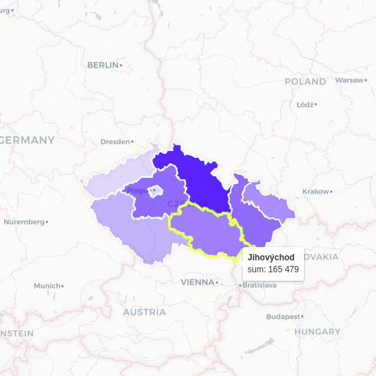
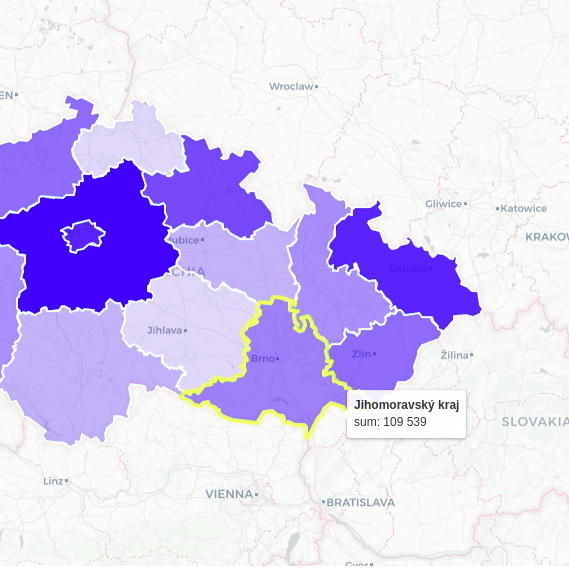

# Geovisto Hierarchy Tool
Module for the [Geovisto core library](https://github.com/geovisto/geovisto).

Tool provides ability to manage displayed geographic objects (point, polygon) according to zoom level of map.
Data value of geographical object can be obtained from its hierarchicly lowest objects. (e.g. country value is sum of its district values etc.)

User can define links between object and can configure level of zoom in which each object becomes visible/invisible. 

**Can be used only with thematic map layers, that supports this tool.**

This repository is a snapshot of Geoviosto ``tools/hierarchy`` derived from the development repository: [geovisto/geovisto-map](https://github.com/geovisto/geovisto-map).


## Usage

```js
import {
    GeovistoHierarchyTool
} from 'geovisto-tool-hierarchy';

// create instance of map with given props
const map = Geovisto.createMap({
  // ...
  tools?: Geovisto.createMapToolsManager([
    // Instance of hierarchy tool
    GeovistoHierarchyTool.createTool({
        id: "geovisto-tool-hierarchy"
    }),
  ])
});

// rendering of the map
map.draw(Geovisto.getMapConfigManagerFactory().default({
  // initial settings of the map can be overriden by the map config - JSON structure providing user settings
  tools?: [
    // configuration of Geovisto tools (extensions) used in the map
    {
        "type": "geovisto-tool-hierarchy",
        "id": "geovisto-tool-hierarchy",
        "enabled": true,
        "layerName": "Hierarchy layer",
        // Hierarchy definitions
        "hierarchies": [
            {   // Name of geo data domain associated with this hierarchy definition.     
                "name" : "name domain",
                // Aggregation flag, if true, data values are agregated to higher objects of hierarchy from lowest.
                "aggregation" : true,      
                "hierarchy": [  // Definition of hierarchy between geo objects.
                    {
                        "id": "Alfa",       // Id of geo object
                        "parent": "",       // Id of parent object, empty if without parent.
                        "zoomLevel": 10     // Level of zoom, when object becames visible.
                    },{
                        "id": "Beta",
                        "parent": "Alfa",
                        "zoomLevel": 13
                    },{
                        ...
                    }
                ]
            }, {
                ...
            }
        ]
    }
));
```

## Example
Pictures below show demonstrative vizualization of this tool with use of **Choropleth layer**.
Zoom level: 3| Zoom level: 4
-|-
  |  

Tool is usable only with map layers that support hierarchy tool. For now its only:
 - [Choropleth map](https://www.npmjs.com/package/geovisto-layer-choropleth)
 - [Marker map](https://www.npmjs.com/package/geovisto-layer-marker)
 - [Connection map](https://www.npmjs.com/package/geovisto-layer-connection)

## Installation

```
npm install --save geovisto-tool-hierarchy
```

This package serves as an extension of Geovisto core using the API for Geovisto tools (extensions). Follow Geovisto core on [Github](https://github.com/geovisto/geovisto).

## License

[MIT](https://github.com/geovisto/geovisto-hierarchy/blob/master/LICENSE)
